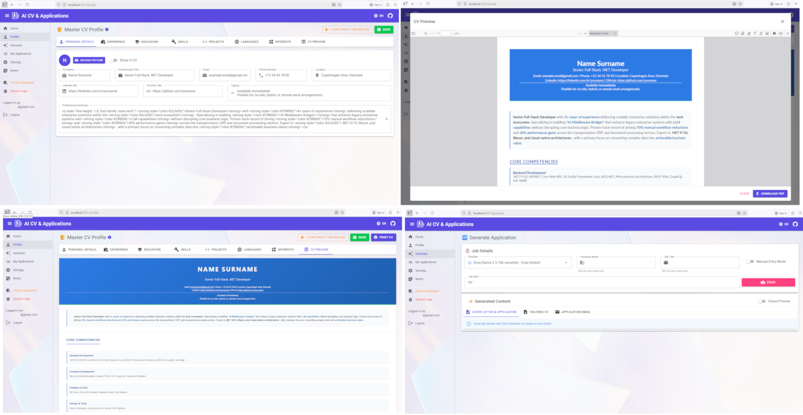

# AiCV Application Generator

[](https://opensource.org/licenses/MIT)
[](https://dotnet.microsoft.com/)
[](https://hub.docker.com/r/timi74/aicv)

**AiCV** is a powerful, self-hosted AI career assistant built with **.NET 10** and **Blazor Server**. It helps you automatically generate tailored CVs and cover letters optimized for specific job postings using your preferred LLM provider.

## 🌐 [Live Demo](https://aicv.fitim.it.com)
>
> [!IMPORTANT]
> To use the generation features in the live demo, you will need to provide your own LLM API key (OpenAI, Gemini, etc.) in the **Settings** page. **Your keys are stored encrypted at rest in the database** and can be deleted by you at any time.



## 🚀 Features

- **Multi-Provider AI Support**: Bring your own API keys for **OpenAI**, **Google Gemini**, **Claude (Anthropic)**, **Groq**, **DeepSeek**, or **OpenRouter**.
- **Smart Job Scraping**: Paste a job URL (LinkedIn, Indeed, etc.) or manually enter details. The system uses smart extraction to parse requirements.
- **Privacy-First**: Your data and API keys are stored locally in your database. Keys are encrypted at rest.
- **Multi-User & Secure**: Supports user registration, login, and OAuth (Google, Microsoft, GitHub).
- **Multi-Language**: UI available in **English**, **Albanian (Shqip)**, and **Danish (Dansk)**.
- **Professional Exports**: Generate and download PDFs, or export to Markdown/JSON.
- **Modern UI**: Built with MudBlazor for a responsive experience.

## 🛠️ Tech Stack

- **Framework**: .NET 10 (Blazor Server)
- **Database**: SQL Server or PostgreSQL (switchable via config)
- **ORM**: Entity Framework Core
- **UI**: MudBlazor
- **PDF Generation**: QuestPDF

## 🏁 Getting Started

### Prerequisites

- [Docker Desktop](https://www.docker.com/products/docker-desktop) (Recommended for easiest setup)
- **OR** [.NET 10 SDK](https://dotnet.microsoft.com/download) + SQL Server/PostgreSQL instance.

### 🐳 Quick Start with Docker

1. Create a `docker-compose.yml` (or use the one in `docs/`):

    ```yaml
    services:
      app:
        image: timi74/aicv:latest
        ports:
          - "8080:80"
        environment:
          - DB_PROVIDER=PostgreSQL
          - PG_HOST=db
          - DB_PASSWORD=YourSecurePassword123!
        depends_on:
          - db
      db:
        image: postgres:16-alpine
        environment:
          - POSTGRES_PASSWORD=YourSecurePassword123!
    ```

2. Run `docker-compose up -d`.
3. Open `http://localhost:8080`.

### 🔧 Local Development Setup

1. **Clone the repository**:

    ```bash
    git clone https://github.com/FitimZulfiju/Ai-CV-application-generator.git
    cd Ai-CV-application-generator
    ```

2. **Configure Environment**:
    Copy `.env.example` to `.env` and update your database credentials and optional OAuth keys.

    ```bash
    cp .env.example .env
    ```

3. **Run the Application**:

    ```bash
    dotnet run --project AiCV.Web
    ```

4. **Visit**: `https://localhost:7153`

## 📘 Usage

1. **Register/Login**: Create an account.
2. **Profile**: Go to **Profile** and fill in your details (Experience, Skills, Education).
3. **Settings**: Enter your API Key for your preferred provider (e.g., OpenAI, Gemini, Groq).
4. **Generate**:
    - Go to **Job Applications**.
    - Paste a Job URL and click **Fetch** (or enter details manually).
    - Select your AI Model.
    - Click **Generate**.
5. **Export**: Review your tailored CV/Cover Letter and download as PDF.

## 🌍 Supported AI Providers

- **OpenAI** (GPT-4o, GPT-4-turbo, etc.)
- **Google Gemini** (Gemini 2.0 Flash, Pro, etc.)
- **Claude** (Anthropic)
- **Groq** (Llama 3, Mixtral - High Speed)
- **DeepSeek** (DeepSeek Chat/Coder)
- **OpenRouter** (Access to any other model)

## 🤝 Contributing

Contributions are welcome! Please read our [CONTRIBUTING.md](CONTRIBUTING.md) for details on our code of conduct and the process for submitting pull requests.

## 📄 License

This project is licensed under the MIT License - see the [LICENSE](LICENSE) file for details.

## 🔗 Links

- [**Live Demo**](https://aicv.fitim.it.com)
- [**Docker Hub**](https://hub.docker.com/r/timi74/aicv)
- [**GitHub**](https://github.com/FitimZulfiju/Ai-CV-application-generator)
