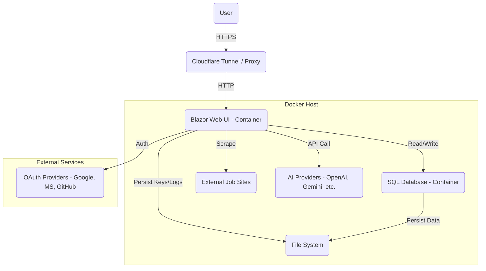

# Architecture Overview — AiCV: Self-Hosted AI Job Application Generator

> ⚠️ **Note:** This is an early-stage, experimental project. Architecture and implementation may change as the system evolves.

## 1. System Overview

* Blazor Server web application with SQL database backend
* Enables users to create/manage profiles, configure AI models, and generate CVs & cover letters
* Multi-user support; can be self-hosted locally or online
* Goals: privacy-first, flexible AI provider integration, experiment with AI-assisted workflows

## 2. High-Level Components

### Blazor Web UI

* User authentication (local + OAuth)
* Profile management (personal details, experience, skills)
* Settings for API keys and model selection
* Job ingestion and generation interface
* Output preview and export (HTML, PDF, Markdown, JSON)
* Session management and notifications

### SQL Database

* Stores users, encrypted API keys, profiles, generated documents
* Persists active sessions
* Multi-provider support (PostgreSQL/SQL Server)

### AI Orchestration Layer

* Receives generation requests
* Selects provider and model per user
* Sends structured profile/job data to AI
* Returns JSON outputs for rendering

### Job Scraper / Input Processor

* Scrapes job postings or accepts manual input
* Normalizes text for AI consumption

### Output Renderer

* Formats CV and cover letter in multiple formats
* Applies predefined templates
* Supports preview and download

### Deployment / DevOps Components

* Docker Compose setup:

  * Blazor app container
  * SQL container
  * Optional Watchtower for automated updates
* Optional Cloudflare Tunnel for secure remote access
* Networking managed by Docker Compose

## 3. Data Flow

1. User fills profile → saved in SQL
2. Job URL → Scraper extracts text OR manual input → normalized
3. User selects AI provider/model → AI Orchestration sends structured request → receives JSON response
4. Output Renderer formats CV & cover letter → preview & export
5. Optional storage in SQL for reuse

## 4. Security & Privacy

* API keys encrypted at rest
* Only structured profile data sent to AI
* No raw personal documents transmitted
* Users choose providers/models

## 5. Multi-User Support

* Supports multiple concurrent users
* Isolated profiles and generated documents
* OAuth login (Google, Microsoft, GitHub)
* Session persistence prevents data loss

## 6. Optional Features

* Multi-provider/model support
* Watchtower automatic updates
* Template customization
* Cloudflare Tunnel automation

## 7. Conceptual Diagram

