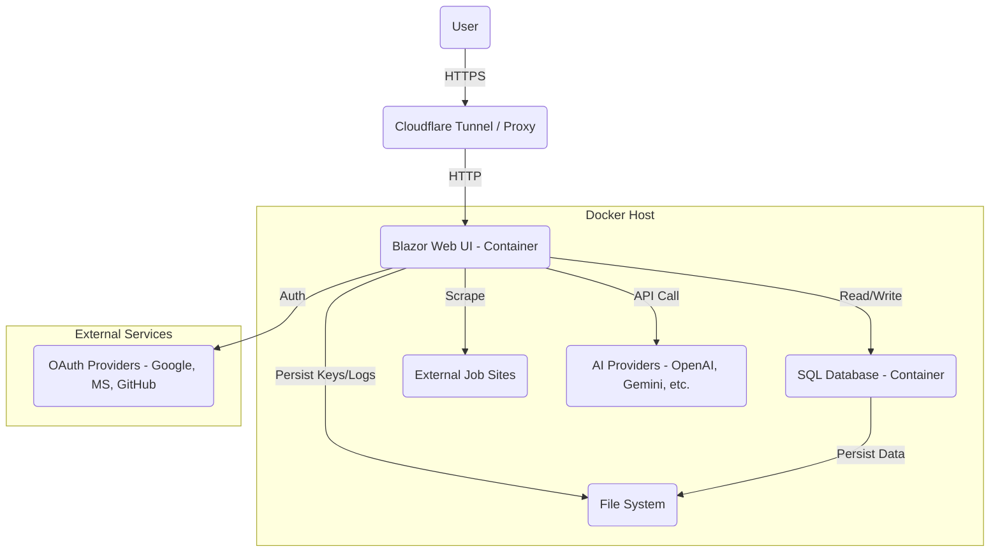

# Architecture Overview — AiCV: Self-Hosted AI Job Application Generator

> ⚠️ **Note:** This is an early-stage, experimental project. Architecture and implementation may change as the system evolves.

## 1. System Overview

* Blazor Server web application with SQL database backend
* Enables users to create/manage profiles, configure AI models, and generate CVs & cover letters
* Multi-user support; can be self-hosted locally or online
* Goals: privacy-first, flexible AI provider integration, experiment with AI-assisted workflows

## 2. High-Level Components

### Blazor Web UI

* User authentication (local + OAuth)
* Profile management (personal details, experience, skills)
* Settings for API keys and model selection
* Job ingestion and generation interface
* Output preview and export (HTML, PDF, Markdown, JSON)
* Account self-service (permanent deletion and OAuth account merging)
* Session management and notifications

### SQL Database

* Stores users, encrypted API keys, profiles, generated documents
* Implements **Cascading Deletes** for automatic cleanup of all user-associated data (profiles, applications, configurations)
* Persists active sessions
* Multi-provider support (PostgreSQL/SQL Server)

### AI Orchestration Layer

* Receives generation requests
* Selects provider and model per user
* Sends structured profile/job data to AI
* Returns JSON outputs for rendering

### Job Scraper / Input Processor

* Scrapes job postings or accepts manual input
* Normalizes text for AI consumption

### Output Renderer

* Formats CV and cover letter in multiple formats
* Applies predefined templates with centralized styles ensuring visual parity between HTML preview and PDF output
* Utilizes a unified rendering pipeline with shared base configurations (`PdfTemplateBase`, `CvTemplateBase`)
* Supports preview and download

### Deployment / DevOps Components

* Docker Compose setup:

  * Blazor app container
  * SQL container
  * Optional Watchtower for automated updates
* Optional Cloudflare Tunnel for secure remote access
* Networking managed by Docker Compose

## 3. Data Flow

1. User fills profile → saved in SQL
2. Job URL → Scraper extracts text OR manual input → normalized
3. User selects AI provider/model → AI Orchestration sends structured request → receives JSON response
4. Output Renderer formats CV & cover letter → preview & export
5. Optional storage in SQL for reuse

## 4. Security & Privacy

* API keys encrypted at rest
* Only structured profile data sent to AI
* No raw personal documents transmitted
* Users choose providers/models

## 5. Multi-User Support

* Supports multiple concurrent users
* Isolated profiles and generated documents
* OAuth login (Google, Microsoft, GitHub)
* Session persistence prevents data loss

## 6. Optional Features

* Multi-provider/model support
* Watchtower automatic updates
* Template customization
* Cloudflare Tunnel automation

## 7. Conceptual Diagram

```mermaid
graph TD
    User(User) -->|HTTPS| Cloudflare(Cloudflare Tunnel / Proxy)
    Cloudflare -->|HTTP| WebUI(Blazor Web UI - Container)

    subgraph "Docker Host"
        WebUI -->|Read/Write| SQL(SQL Database - Container)
        WebUI -->|Scrape| JobSites(External Job Sites)
        WebUI -->|API Call| AI(AI Providers - OpenAI, Gemini, etc.)

        FileSys(File System)
        WebUI -->|Persist Keys/Logs| FileSys
        SQL -->|Persist Data| FileSys
    end

    subgraph "External Services"
        AI
        JobSites
        OAuth(OAuth Providers - Google, MS, GitHub)
        WebUI -->|Auth| OAuth
    end
```

## 8. Codebase Structure

The project is built with .NET 10.0 and Blazor Server, following a clean architecture-inspired structure.

### `AiCV.Domain`
- Contains core entities and domain logic.
- No dependencies on other projects.
- Entities: `User`, `CandidateProfile`, `WorkExperience`, `Education`, `Skill`, `Project`, etc.

### `AiCV.Application`
- Contains business logic, interfaces, and DTOs.
- `Interfaces`: Define service contracts (`ICVService`, `IPdfService`, etc.).
- `Common`: Shared utilities like `CvUtils`.

### `AiCV.Infrastructure`
- Implementation of external services and data access.
- `Data`: `ApplicationDbContext` and Migrations (via separate migration projects).
- `Services`: Orchestrates external dependencies like `PdfService`.
- `Extensions`: Modular service registrations.

### `AiCV.Web`
- The Blazor Server application (UI).
- `Components`:
    - `Pages`: Routed pages (`Home.razor`, `Profile.razor`).
    - `Shared`: Reusable UI components.
    - `Shared/ProfileSections`: Extracted sections from the large Profile page.
- `Features`: Contains vertical slices of functionality, such as `CvRendering` (which includes unified components like `CvDocument.razor` and `CoverLetterDocument.razor`).
- `Extensions`: Web-specific configurations.

## 9. Key Design Patterns

### Modular Startup
The `Program.cs` is kept lean by delegating configuration to extension methods in the `AiCV.Web.Extensions` and `AiCV.Infrastructure.Extensions` namespaces.

### Template Method / Strategy for PDF and HTML Generation
Visual tokens (colors, borders, feature flags) are strictly centralized in a `CvThemeConfig` record in the Application layer, mapped via a `ThemeRegistry`. 
- **PDF Generation**: Encapsulated in separate template classes inheriting from `PdfTemplateBase`. `PdfService` orchestrates the font-scaling and delegates to the appropriate builder, which automatically applies the `CvThemeConfig`.
- **HTML Rendering**: Consolidated via shared components like `CvDocument.razor` and `CoverLetterDocument.razor`. These components inject the `CvThemeConfig` colors as root CSS variables (e.g., `var(--primary-color)`). This architecture completely eliminates color duplication between C# and CSS, guaranteeing high fidelity and parity between the Web UI and PDF outputs.

### Componentized UI
Large Razor pages are broken down into smaller, focused components (e.g., `WorkExperienceSection.razor`) to improve readability.

## 10. Database Strategy
The application supports both **PostgreSQL** and **SQL Server**.
- Provider is selected via the `DB_PROVIDER` environment variable.
- Connection strings can be provided via standard `DefaultConnection` or specific env vars.
- Migrations are isolated into `AiCV.Migrations.PostgreSQL` and `AiCV.Migrations.SqlServer` projects.
